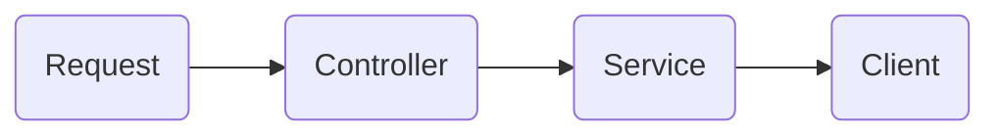

# Torrent Kitty Service

## Architect

This is a typical SpringBoot Application. 

### Controller

The controller class will provide restful API to the external calling. It will be implemented using Spring.

### Service

The controller will call the service class to do the actual handling of the call.

### Client

The wrapper of http client implementations. It will request torrentkitty website and extract the useful imformation from
the http response

## dependencies